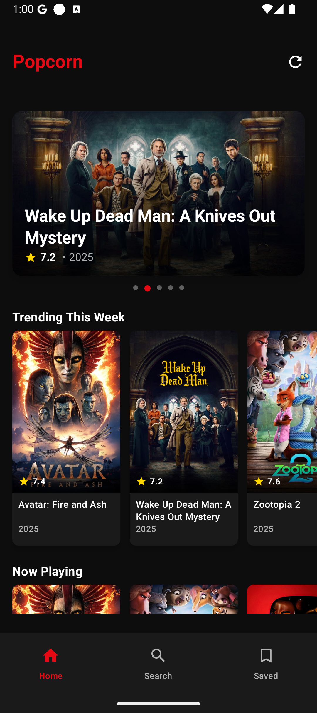
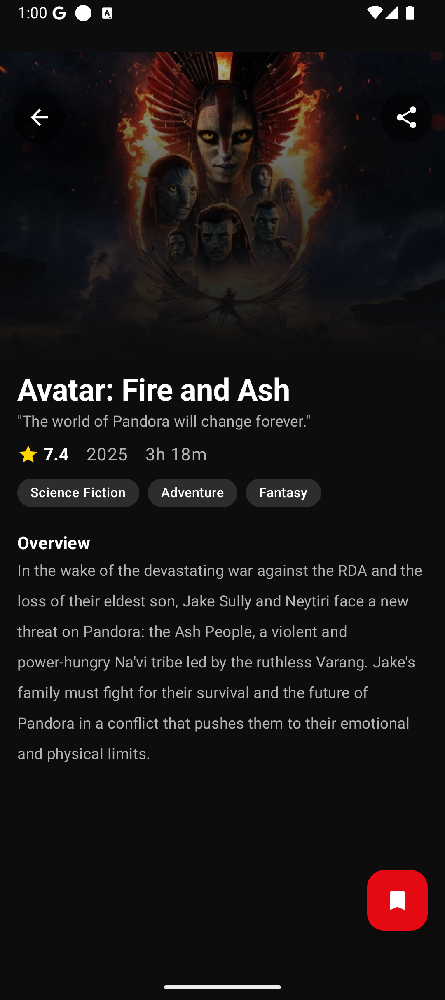
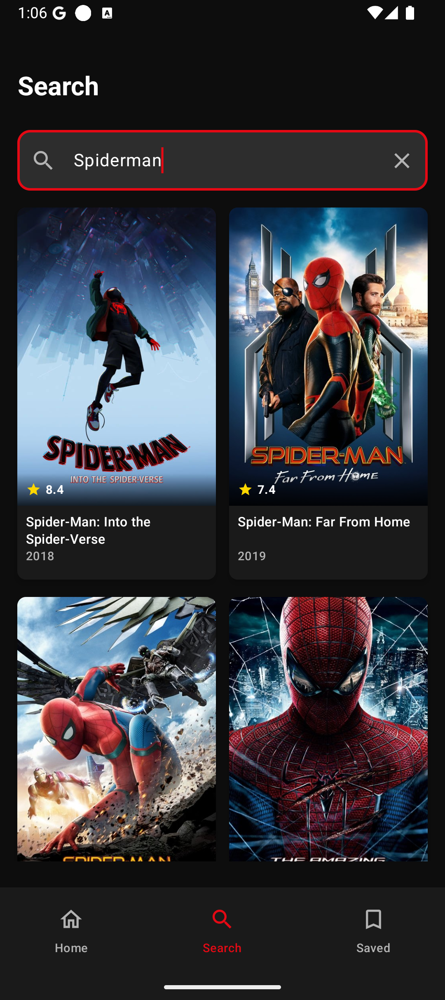
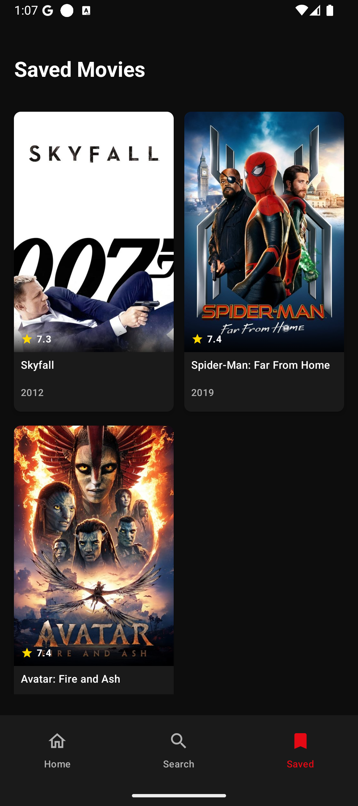

# 🍿 Popcorn - Movies Database App

A feature-rich Android movie discovery app built with modern Android development practices.


## ✨ Features

- **🔥 Trending Movies** - Browse this week's trending movies
- **🎬 Now Playing** - See movies currently in theaters
- **🔍 Search** - Search for any movie with debounced input
- **🔖 Bookmarks** - Save your favorite movies locally
- **📱 Offline Support** - Works without internet using cached data
- **🔗 Deep Links** - Share movies with friends via app links
- **🌙 Dark Theme** - Netflix-inspired premium dark UI

## 🏗️ Architecture

This app follows **Clean Architecture** with **MVVM** pattern:

```
app/
├── data/
│   ├── local/          # Room database, DAOs, entities
│   ├── remote/         # Retrofit API service, DTOs
│   ├── repository/     # Repository implementations
│   └── mapper/         # Data mappers
├── domain/
│   ├── model/          # Domain models
│   └── repository/     # Repository interfaces
├── presentation/
│   ├── home/           # Home screen
│   ├── details/        # Movie details
│   ├── search/         # Search screen
│   ├── saved/          # Bookmarked movies
│   ├── components/     # Reusable UI components
│   └── navigation/     # Navigation setup
├── di/                 # Hilt dependency injection
├── ui/theme/           # Material 3 theming
└── util/               # Utility classes
```

## 🛠️ Tech Stack

| Category | Library |
|----------|---------|
| **UI** | Jetpack Compose, Material 3 |
| **Architecture** | MVVM, Clean Architecture |
| **DI** | Hilt |
| **Networking** | Retrofit, OkHttp, Gson |
| **Database** | Room |
| **Image Loading** | Coil |
| **Async** | Kotlin Coroutines, Flow |
| **Navigation** | Compose Navigation |

## 🚀 Getting Started

### Prerequisites
- Android Studio Hedgehog or later
- JDK 17
- Android SDK 35

### Setup

1. Clone the repository:
   ```bash
   git clone https://github.com/jaypatelbond/Popcorn.git
   ```

2. Open in Android Studio

3. Sync Gradle and run on device/emulator

> **Note**: TMDB API key is already configured in the project.

## 📸 Screenshots

<p align="center">
  
  
  
  
</p>

## 📦 APK Download

[Download Latest APK](apk/popcorn.apk)

## 🎯 Task Checklist

- [x] Home page with trending and now playing movies
- [x] Movie details page with full information
- [x] Bookmark movies and saved movies page
- [x] Offline support with Room database
- [x] Search with debounced input
- [x] Share movie with deep linking
---

Built with ❤️ by [Jay Patel](https://github.com/jaypatelbond)
